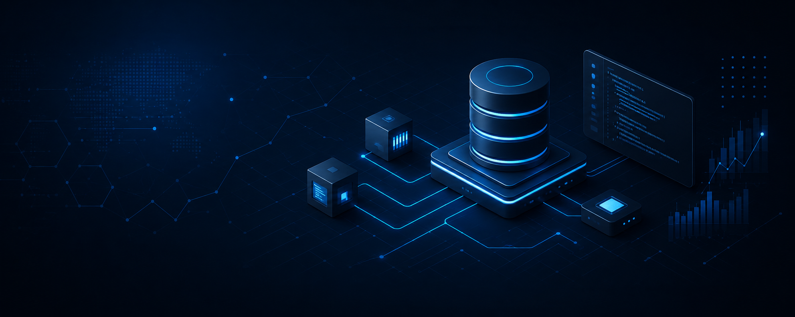

  

<h1 align="center">Manit Bhattarai</h1>

  <b>Computer Science Undergraduate</b>

Interested in Data Engineering, Artificial Intelligence, Machine Learning, and Backend Development.

---

## About Me

I'm a Computer Science undergraduate passionate about building software that transforms data into practical, reliable, and intelligent systems.

I enjoy working across the entire development process—from designing data pipelines and backend services to developing machine learning solutions. My focus is on understanding how systems work internally and applying solid engineering principles to build maintainable software.

---

## Tech Stack

### Languages

### Data Engineering

### Machine Learning

### Backend & Tools

---

## Areas of Interest

- Data Engineering
- Artificial Intelligence
- Machine Learning
- Backend Development
- Distributed Systems
- Systems Programming

---

*"Always learning. Always building."*

